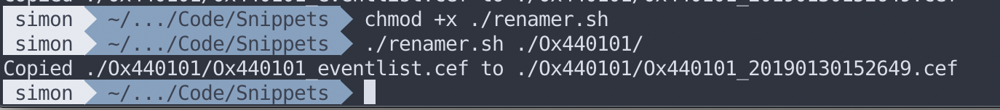

# Paedneuro Renamer
This is a small script tat can be used to rename eventlist (or other) files to match the name format used in the rest of the directory they are in. It is specifically set up to help with renaming files matching the oxford paed neuro team's naming convention.

## Use
In order to set up ready to use:-
1. Download this repository using git, or the green button in github
2. Open the terminal
3. Use cd (change directory) to navigate to the folder this file is in
4. Give it executable permission using `chmod +x ./renamer.sh`

In order to use it:-
1. Open the terminal
2. Use cd (change directory) to navigate to the folder this file is in
3. Work out where your directory of interest is
4. Run it using `./renamer.sh <directory-to-check>`
5. It will tell you the names of any files found and copied

An example of use is shown below.

## Advanced use
* You can specify the filename end of files to rename. To do so, use the second argument when calling the script, ie. `./renamer.sh <directory-to-check> <filename>`.
* If you forget to include any arguments, the script will prompt you to type in the name of the directory to look in.